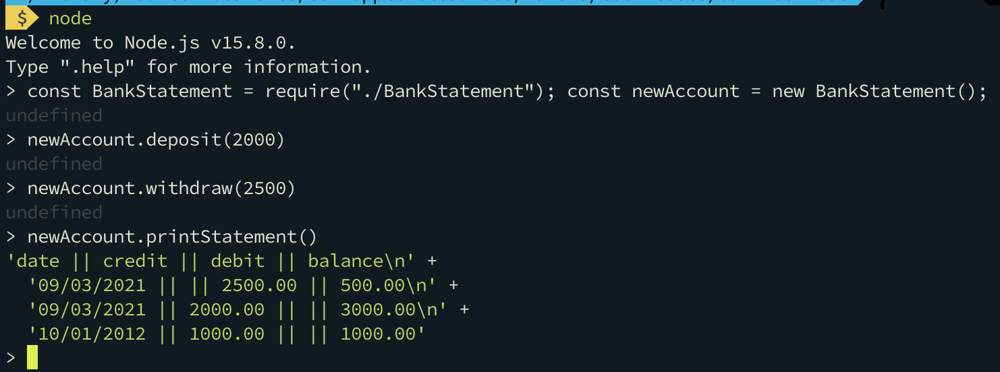

# Bank Tech Test

Individual tech test.

## Objective

Using BDD principles follow a structured process to complete the problem, utilising TDD and good OO design skills.

## Technologies used

JavaScript. Tested using Jest.

## How to use

#### Download repo and install packages

1. Clone repo `git clone https://github.com/Reeshul/bankTechTest`
2. Change directory `cd bankTechTest`
3. Install packages `npm i`

#### Testing

4. Run `npm t`

#### Using the app

5. Run `node`
6. In the REPL enter `const BankStatement = require("./BankStatement"); const newAccount = new BankStatement();`
7. Deposit and withdraw as your wish using the `.deposit()` and `.withdraw()` methods on your newAccount
8. To print your statement enter `newAccount.printStatement()`

